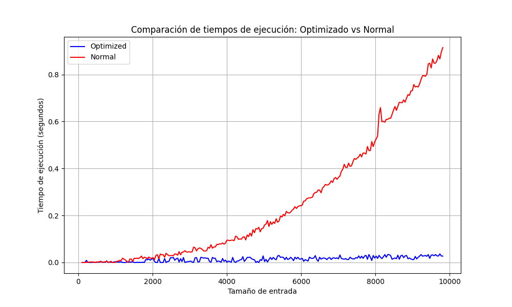
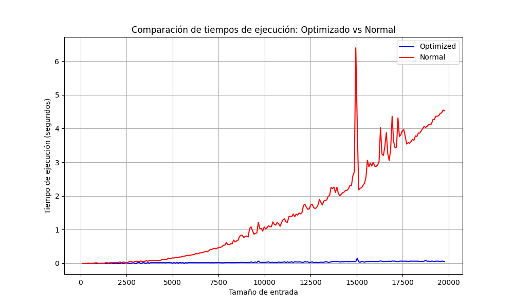

# Videojuego

Estás creando un nivel para un videojuego. El nivel consiste en $n$ habitaciones dispuestas en un círculo. Las habitaciones están numeradas del $1$ al $n$. Cada habitación contiene exactamente una salida: completar la $j$-ésima habitación te permite pasar a la $(j+1)$-ésima habitación (y completar la $n$-ésima habitación te permite pasar a la $1$-era habitación).

Se te da la descripción del multiconjunto de $n$ cofres: el $i$-ésimo cofre tiene un valor de tesoro $c_i$.

Cada cofre puede ser de uno de dos tipos:

- cofre normal — cuando un jugador entra en una habitación con este cofre, recoge el tesoro y procede a la siguiente habitación;
- cofre trampa — cuando un jugador entra en una habitación con este cofre, el cofre se lo come vivo, y él pierde.

El jugador comienza en una habitación aleatoria, con cada habitación teniendo la misma probabilidad de ser elegida. Las ganancias del jugador son iguales al valor total de los tesoros que haya recogido antes de perder.

Se te permite elegir el orden en que los cofres se colocan en las habitaciones. Para cada $k$ de $1$ a $n$, coloca los cofres en las habitaciones de tal manera que:

- cada habitación contenga exactamente un cofre;
- exactamente $k$ cofres sean trampas;
- el valor esperado de las ganancias del jugador sea el mínimo posible.

Ten en cuenta que para cada $k$ la colocación se elige de manera independiente.

Se puede ver que está en la forma de $\frac{P}{Q}$ donde $P$ y $Q$ son enteros no negativos y $Q≠0$.

# Solucion del Problema

## Definimos el valor esperado

El problema se trata de minimizar el **valor esperado** de las ganancias del jugador, dado que comienza en una habitación aleatoria. El valor esperado de las ganancias se puede definir como:

$$
E = \frac{\text{suma total de ganancias sobre todas las posiciones}}{n}
$$

Donde $n$ es el número total de habitaciones (o cofres). Como estamos buscando minimizar este valor esperado, es equivalente a **minimizar la suma total de ganancias**, ya que $n$ es constante. **Por lo tanto, reformulamos el problema como la minimización de la suma total de las ganancias**.

---

## Rotación y distribución de cofres regulares y trampas

Para simplificar el análisis, **rotamos las habitaciones** de tal forma que la última habitación siempre contenga una trampa. Esto no cambia la naturaleza del problema, pero facilita la distribución de cofres regulares y trampas en el análisis.

Supongamos que tenemos $k$ trampas. Entonces, las habitaciones se distribuyen en $k$ grupos, donde cada grupo contiene $\text{cnt}_i$ cofres regulares seguidos de una trampa. Los $\text{cnt}_i$ satisfacen la siguiente restricción:

<!-- $$
\begin{array}{c}
\text{cnt}_i \geq 0 \quad \text{y} \quad \sum_{i=1}^{k} \text{cnt}_i = n - k
\end{array}
$$ -->

Esto significa que los $n - k$ cofres regulares se distribuyen en los $k$ intervalos entre las trampas.

## Ejemplo:

Supongamos que tenemos $n = 10$ habitaciones y $k = 3$ trampas. El jugador comienza en una habitación aleatoria, y las trampas están distribuidas. Los valores de los cofres son los siguientes:

### Lista de habitaciones con cofres y trampas:
[100, 200, **Trampa**, **Trampa**, 50, 300, **Trampa**, 500, 400, **Trampa**]

### Distribución de intervalos:

<!-- $$
\underbrace{\text{100, 200}}_{\text{cnt}_1 = 2} \quad
\underbrace{\text{Trampa, Trampa}}_{\text{cnt}_2 = 0} \quad
\underbrace{\text{50, 300}}_{\text{cnt}_3 = 2} \quad
\underbrace{\text{500, 400}}_{\text{cnt}_4 = 2}
$$ -->

### Restricción de los intervalos:

Tenemos que:

$$
\sum_{i=1}^{\text{k}=4} \text{cnt}_i = n - k = 10 - 4 = 6
$$

Y, efectivamente:

$$
\text{cnt}_1 = 2, \quad \text{cnt}_2 = 0, \quad \text{cnt}_3 = 2, \quad \text{cnt}_4 = 2
$$

Por lo tanto, los cofres regulares se distribuyen entre las trampas como sigue:

- Intervalo 1 tiene 2 cofres (valores 100 y 200), seguido de una trampa.
- Intervalo 2 es vacío, ya que hay dos trampas seguidas sin cofres regulares.
- Intervalo 3 tiene 2 cofres (valores 50 y 300), seguido de una trampa.
- Intervalo 4 tiene 2 cofres (valores 500 y 400), seguido de una trampa.

---
## Coeficientes y secuencias de ganancias

El **coeficiente** de un cofre $c$ es el número de veces que el jugador puede recoger ese cofre desde las distintas posiciones iniciales de un intervalo antes de caer en una trampa. En un intervalo con $\text{cnt}_i$ cofres regulares, el **último cofre** del intervalo puede ser recogido $\text{cnt}_i$ veces, el penúltimo $\text{cnt}_i - 1$ veces, y así sucesivamente, essto debido a la naturaleza del juego de avanzar a la siguiente habitacion si no me encuentro un cofre Trampa.

Cada cofre tiene un coeficiente que refleja cuántas veces puede ser recogido dependiendo de su proximidad a la siguiente trampa. Los cofres más cercanos a la siguiente trampa tienen coeficientes más altos, ya que son alcanzables desde más posiciones iniciales. Esto significa que, cuanto más cerca esté el cofre de la siguiente trampa, mayor es su contribución potencial a las ganancias totales del jugador.

La **suma total de ganancias** en un intervalo se puede expresar como:

$$
\sum_{j=1}^{\text{cnt}_i} j \cdot v_j
$$

Donde $v_j$ es el valor del $j$-ésimo cofre del intervalo. Este cálculo asegura que los cofres más valiosos y cercanos a la trampa contribuyen más a las ganancias, ya que tienen mayores coeficientes. 

Esto se debe a que el número de veces que un cofre puede ser recogido depende directamente de su posición en relación con la trampa: los cofres más cercanos a la trampa pueden ser recogidos desde más posiciones iniciales. Al multiplicar el valor de cada cofre por su coeficiente, estamos sumando el impacto real de cada cofre en las ganancias totales, reflejando cómo su posición y valor combinan para maximizar o minimizar las ganancias en el intervalo.

---
## Balanceo de los intervalos

Cuando tenemos dos intervalos de cofres con diferentes tamaños, podemos **mejorar** la distribución de las ganancias moviendo cofres del intervalo más grande al más pequeño. Esto ayuda a minimizar el total de ganancias del jugador, ya que los coeficientes de los cofres cambian dependiendo del intervalo al que pertenecen.

El concepto clave es que los **coeficientes** afectan la suma total de ganancias: un cofre en el intervalo más grande tiene un coeficiente más alto (y por lo tanto contribuye más a la suma total de ganancias), mientras que si movemos ese cofre al intervalo más pequeño, su coeficiente será más bajo, lo que reducirá las ganancias totales.

### Demostración del balanceo:

1. **Identificar los intervalos más grande y más pequeño**:
   - Supongamos que el intervalo más grande tiene $y$ cofres, y el más pequeño tiene $x$ cofres, donde $x \leq y - 2$.
   - Queremos reducir esta diferencia moviendo un cofre del intervalo más grande al más pequeño.

2. **Secuencias de coeficientes**:
   - En el intervalo más pequeño ($x$), los cofres tienen los coeficientes $[1, 2, \dots, x]$.
   - En el intervalo más grande ($y$), los cofres tienen los coeficientes $[1, 2, \dots, y]$.
   - La contribución a las ganancias está dada por $\sum_{j=1}^{x} j \cdot v_j$ para el intervalo pequeño y $\sum_{j=1}^{y} j \cdot v_j$ para el grande.

3. **Mover el cofre**:
   - Antes del movimiento, el último cofre del intervalo grande tiene un coeficiente $y$, y el último cofre del intervalo pequeño tiene un coeficiente $x$.
   - Si movemos el cofre del intervalo grande al pequeño, el coeficiente de ese cofre baja de $y$ a $x + 1$. Esto significa que el cofre ahora se recoge menos veces, **reduciendo la suma total de ganancias**.
   
4. **Justificación matemática**:
   - La secuencia de coeficientes en el intervalo más pequeño, después de mover el cofre, será $[1, 2, \dots, x, x + 1]$.
   - La secuencia en el intervalo más grande será $[1, 2, \dots, y - 1]$.
   - Al reducir el coeficiente más alto de $y$ a $x + 1$, hemos logrado una reducción efectiva en la suma total de ganancias, ya que el cofre valioso del intervalo más grande se recoge menos veces. Esto **minimiza** el impacto de ese cofre en las ganancias totales.
   -  ### Demostración:

      Cuando movemos un cofre del intervalo grande al intervalo pequeño, la contribución de ese cofre a la suma total de ganancias cambia, ya que su **coeficiente** cambia. 

      - **Antes del movimiento**: El cofre $v_j$ está en el intervalo grande, donde su coeficiente es $y$, por lo que su contribución a las ganancias es $v_j \times y$.
      - **Después del movimiento**: El cofre se mueve al intervalo pequeño, donde su nuevo coeficiente es $x + 1$, lo que significa que su contribución ahora es $v_j \times (x + 1)$.

      La **reducción en las ganancias** es la diferencia entre la contribución original y la nueva contribución:

      ))

      <!-- $$
      \Delta \text{Ganancia} = v_j \times (y - (x + 1))
      $$ -->

      Donde:
      - $v_j$ es el valor del cofre ($v_j \geq 0$).
      - $y$ es el coeficiente en el intervalo grande ($x \leq y - 2$).
      - $x + 1$ es el nuevo coeficiente en el intervalo pequeño ($x > 0$) .

      Este resultado muestra que al mover un cofre del intervalo más grande al más pequeño, estamos disminuyendo su coeficiente, lo que significa que el cofre se recogerá menos veces, y por lo tanto, su contribución total a las ganancias se reducirá. La fórmula $v_j \times (y - (x + 1))$ refleja precisamente cuánto disminuyen las ganancias cuando el cofre es movido.

      Si la diferencia entre $y$ y $x + 1$ es grande, la reducción en las ganancias será mayor, por lo cual mover cofres de intervalos grandes a pequeños es una estrategia efectiva para minimizar las ganancias totales.

---

## Asignación óptima de cofres regulares

Después de balancear los intervalos, el siguiente paso es asignar los cofres regulares de manera **óptima**. El objetivo es minimizar las ganancias esperadas del jugador.

## Proceso de asignación:

1. **Unión de coeficientes**: Después de definir todos los $\text{cnt}_i$ (los tamaños de cada intervalo), debemos unir todas las secuencias de coeficientes desde los diferentes intervalos. Esto nos da una secuencia que abarca todas las posiciones posibles donde los cofres pueden ser asignados. Los coeficientes de cada intervalo forman secuencias $[1, 2, \dots, \text{cnt}_i]$ para cada $i$. Una vez que unimos estas secuencias de coeficientes, obtenemos la secuencia global de coeficientes $\bigcup_{i=1}^{n-k} [1, 2, \dots, \text{cnt}_i]$.

2. **Ordenar los cofres por valor**: Para minimizar las ganancias, es importante colocar los cofres más valiosos en las posiciones con los coeficientes más bajos, es decir, donde el jugador tendrá menos oportunidades de recogerlos. Esto se hace ordenando los valores de los cofres en **orden no creciente** (de mayor a menor). La razón detrás de esto es simple: si los cofres más valiosos se recogen menos veces, contribuyen menos a las ganancias totales.

3. **Asignar los valores a los coeficientes**: Después de unir y ordenar los coeficientes de los intervalos, se asignan los cofres en función de esta secuencia. Los cofres con mayor valor se colocan en los coeficientes más bajos. Esto garantiza que los cofres más valiosos se recojan menos veces y, por lo tanto, **minimicen las ganancias**. Los cofres con coeficiente 0 no generan ninguna ganancia, ya que están colocados en las trampas, lo que garantiza que no serán recogidos por el jugador.

4. **Cofres con coeficiente 0**: Los $k$ cofres que van en las trampas **no contribuyen a las ganancias** del jugador porque el jugador cae en la trampa antes de recogerlos. Por lo tanto, asignamos **coeficiente 0** a los cofres que se colocan en las posiciones donde hay trampas. **Estos cofres son los primeros $k$ cofres de la lista de cofres ordenada**, ya que, para minimizar las ganancias del jugador, es crucial asegurarnos de que los cofres más valiosos no sean recogidos. Colocarlos en las trampas con coeficiente 0 asegura que el jugador no obtenga ninguna ganancia de ellos.

### Porqué esto es óptimo:

El **objetivo** es minimizar la ganancia esperada del jugador, lo que implica que **los cofres más valiosos** deben tener la **menor contribución posible**. Colocar estos cofres en posiciones donde tienen **coeficiente 0** (es decir, en las trampas) garantiza que no generen ninguna ganancia, ya que el jugador nunca los recoge.

Si distribuimos los cofres de manera diferente (por ejemplo, asignando un cofre valioso a una posición con un coeficiente alto), se podría **mejorar** esa disposición moviendo cofres más valiosos a posiciones con coeficientes más bajos o asignándolos a las trampas (coeficiente 0), lo que automáticamente reduciría las ganancias totales. **Ordenar los cofres de mayor a menor valor** y asignarlos a los coeficientes más bajos o a las trampas (coeficiente 0) es la manera **óptima** de proceder para minimizar las ganancias esperadas.

Por lo tanto, asignar los **coeficientes más bajos** a los cofres menos valiosos y el **coeficiente 0** a los cofres más valiosos (colocados en las trampas) es la **estrategia óptima** para minimizar las ganancias esperadas.

---
## Complejidad: $O(n^2)$

El cálculo de las ganancias del jugador, basado en la división en intervalos y el uso de trampas, tiene una complejidad de $O(n^2)$. Esta complejidad surge debido a cómo se asignan los cofres a intervalos y trampas, multiplicando sus valores por los coeficientes correspondientes. A continuación, se explica el porqué.

### Explicación de la solución:

1. **Ordenación de los cofres por valor**:
   - Primero, se ordenan todos los cofres en orden descendente para asegurar que los cofres más valiosos se coloquen en las posiciones menos favorables (donde el jugador tiene menos oportunidades de recogerlos).
   - Esta ordenación toma $O(n \log n)$, pero este paso es menor en comparación con el cálculo posterior de las ganancias.

2. **División entre $k$ y redondeo hacia abajo $\left\lfloor \frac{i}{k} \right\rfloor$**:
   - Para cada valor de $k$ (el número de trampas), dividimos los cofres en $k$ intervalos. Cada intervalo tendrá un conjunto de coeficientes que indican cuántas veces el jugador puede recoger los cofres antes de caer en una trampa.
   - El redondeo $\left\lfloor \frac{i}{k} \right\rfloor$ evidencia cómo los cofres se dividen en estos intervalos. El índice $i$ se divide entre $k$, lo que asigna un coeficiente a cada cofre. Este coeficiente refleja cuántos intervalos completos ha atravesado el jugador antes de llegar al cofre $i$.

3. **Asignación de coeficientes:**
   - Para los **primeros $k$ cofres** (es decir, $i < k$), su coeficiente es 0, porque están en las posiciones que ocupan las trampas. Esto significa que el jugador no puede recoger estos cofres, ya que cae en una trampa antes de llegar a ellos. Esta parte del algoritmo evidencia que los cofres de mayor valor se colocan en posiciones de trampas.
   - Los **siguientes $k$ cofres** reciben un coeficiente de 1, lo que indica que estos cofres pueden ser recogidos una vez antes de que el jugador caiga en una trampa. Este patrón sigue para el resto de los cofres: cada conjunto de $k$ cofres recibe un coeficiente incrementado en 1, lo que refleja cuantas veces pueden ser recogidos antes de que el jugador caiga en la siguiente trampa
   - En términos simples, los cofres más valiosos (los primeros en la lista ordenada) reciben coeficientes más bajos simulanodo asi que en la ubicacion en los intervalos estan mas alejados de la siguiente trampa, y a medida que los coeficientes aumentan, quiere decir que en algun intervalo el cofre que le corresponde esta mas pegado a la siguiente trampa pr lo cual se recoje mas veces en ese intervalo pero como son cofres menos valiosos contribuye menos que otro cofre de mayor valor

4. **Cálculo de las ganancias**:
   - Para cada valor de $k$, multiplicamos el valor de cada cofre por su coeficiente $\left\lfloor \frac{i}{k} \right\rfloor$, sumando los resultados.
   - El **redondeo hacia abajo** ocurre porque los intervalos se dividen en tamaños de $k$. Los cofres dentro del primer intervalo no se recogen antes de caer en una trampa, por lo que sus coeficientes son 0. Los siguientes intervalos tienen coeficientes 1, luego 2, y así sucesivamente. El redondeo refleja esta estructura, asegurando que los cofres en las primeras posiciones (que corresponden a las trampas) no contribuyan a las ganancias.

5. **Repetición del cálculo para cada $k$**:
   - Este proceso se repite para cada $k$, desde 1 hasta $n$. Cada vez que calculamos para un $k$, recorremos todos los cofres y multiplicamos sus valores por $\left\lfloor \frac{i}{k} \right\rfloor$, lo que toma $O(n)$ tiempo para cada $k$.

### Complejidad total:

Como el cálculo de las ganancias para cada $k$ toma $O(n)$ debido a que iteramos sobre todos los cofres, y repetimos este proceso $n$ veces (una vez por cada $k$), la complejidad total es:

$$
O(n) + O(n) + O(n) + \dots + O(n) \text{ (repetido $n$ veces)} = O(n^2)
$$

### Resumen:

- **Para cada valor de $k$**, se multiplican los valores de los cofres por $\left\lfloor \frac{i}{k} \right\rfloor$, reflejando cuántos intervalos completos se han recorrido antes de llegar a ese cofre.
- **Los primeros $k$ cofres** reciben un coeficiente de 0, ya que caen en posiciones de trampas, lo que asegura que los cofres de mayor valor no contribuyen a las ganancias.
- **Este cálculo se repite $n$ veces**, lo que nos da una complejidad total de $O(n^2)$.

---
## Complejidad y Optimización

### Optimización de la complejidad $O(n^2)$

Hasta este punto, hemos visto que el cálculo de las ganancias para cada valor de $k$ nos lleva a una complejidad de $O(n^2)$. Esto ocurre porque, para cada $k$, estamos dividiendo los cofres en intervalos, sumando sus valores y repitiendo este proceso $n$ veces. Para cada cofre, calculamos su contribución multiplicando su valor por el coeficiente $\left\lfloor \frac{i}{k} \right\rfloor$, lo que genera un alto costo computacional.

Sin embargo, podemos **optimizar** este proceso sin cambiar la idea básica del algoritmo de ordenación de cofres. La clave para mejorar la eficiencia está en **reducir el costo del cálculo de las sumas de los cofres en los intervalos** mediante el uso de **sumas prefijas**.

### **PREFIX SUMS**

Para reducir la complejidad del algoritmo, agregamos una fase de **precomputo en $O(n)$** mediante el uso de **sumas prefijas** o **prefix sums**. Esto es especialmente útil cuando necesitamos realizar múltiples consultas sobre la suma de intervalos en una secuencia de datos, como ocurre en nuestro problema.

#### ¿Qué hacen las sumas prefijas?

Las sumas prefijas nos permiten calcular la suma de cualquier intervalo de elementos en **tiempo constante $O(1)$**, después de un preprocesamiento inicial de $O(n)$. En nuestro caso, el **preprocesamiento** consiste en crear un arreglo auxiliar que contiene, en la posición $i$, la suma de todos los cofres desde la posición 0 hasta $i$.

Con esta estructura, la suma de los cofres en cualquier intervalo $[i, j]$ se puede obtener con la fórmula:

$$
\text{sumintervalo}(i, j) = \text{prefix}[j] - \text{prefix}[i - 1]
$$

Esto nos permite calcular la suma de cualquier intervalo de cofres de manera eficiente, sin tener que recorrerlos uno por uno en cada iteración.

### Beneficio de las sumas prefijas en el algoritmo

El verdadero propósito de las **sumas prefijas** es facilitar el cálculo de las sumas de los cofres en cada intervalo, agrupando aquellos que comparten el mismo coeficiente. Esto se hace con el fin de multiplicar la suma total de esos cofres por su coeficiente correspondiente.

Con esto, podemos calcular las sumas mucho más rápido. La idea es que podemos obtener la suma de los primeros $k$ cofres que estan ordenados, los siguientes $k$, y así sucesivamente en **$O(1)$**, evitando la necesidad de recalcular las sumas de nuevo en cada iteración. Esto es bastante útil ya que por ejemplo para los cofres que tienen coeficiente 0 (aquellos que caen en las trampas), podemos multiplicar su suma por 0 directamente, como si estuviéramos sacando un factor común, y hacer lo mismo para los cofres con coeficientes 1, 2, etc.

### Reducción de la complejidad total

La **complejidad total** del algoritmo se reduce de $O(n^2)$ a $O(n \log n)$ de la siguiente manera:

1. **Ordenar los cofres**:
   - La ordenación de los cofres por su valor en orden descendente toma $O(n \log n)$.
   
2. **Preprocesamiento de las sumas prefijas**:
   - Construir el arreglo de sumas prefijas toma $O(n)$, ya que solo necesitamos una pasada sobre los cofres para calcular estas sumas acumuladas.

3. **Cálculo de las ganancias para cada $k$**:
   - Si $n$ no es divisible por $k$, el último bloque tendrá una longitud menor que $k$, pero esto no cambia el análisis general. Para cada $k$, el número de intervalos es precisamente $k$, podemos obtener cada suma de intervalo en $O(1)$ utilizando las sumas prefijas y multiplicarlas por su coeficiente, debido a que esto se hace de $k$ cofres en $k$ cofres en la lsita de los cofres ordenados, llegamos a la conclusion de que en el peor caso, para cada $k$, el cálculo de las ganancias toma $\frac{n}{k}$ operaciones.

4. **Sumatoria para todos los valores de $k$**

   La complejidad total es la suma de los tiempos de cálculo para todos los valores de $k$ desde 1 hasta $n$. Esto implica sumar:

   

   Esta es una sumatoria armónica, cuyo comportamiento asintótico es:

   %20=%20O(n\log%20n))

   Por lo tanto, la complejidad total del algoritmo, después de optimizar con sumas prefijas, se reduce a:

   )

   
---
## Test de Rendimiento y Comparación

### Descripción del Test

Se realizó un test de rendimiento con el objetivo de comparar las salidas y los tiempos de ejecución entre dos versiones de un algoritmo: una versión optimizada y otra no optimizada. El test consistió en ejecutar ambas versiones del algoritmo para diferentes tamaños de entrada, que fueron aumentando progresivamente desde un tamaño inicial de 100 hasta un tamaño máximo de $2 \cdot 10^5$ elementos.

Cada iteración del test generó una lista de números aleatorios entre 1 y $10^6$, y tanto la versión optimizada como la no optimizada procesaron la misma lista. Se midió el tiempo de ejecución de cada versión en cada iteración.

### Objetivo

El objetivo de este test es observar cómo el tiempo de ejecución de ambas versiones del algoritmo se comporta a medida que crece el tamaño de la entrada. Se espera que la versión optimizada tenga un mejor rendimiento, especialmente con tamaños de entrada grandes. Al final del test, se plotearon los tiempos de ejecución para visualizar la diferencia en rendimiento entre las dos versiones.

### Resultados

A continuación se muestra el gráfico que compara los tiempos de ejecución de la versión optimizada y la no optimizada:

Figura 1: Comparación de tiempos de ejecución entre la versión optimizada y la no optimizada para una entrada máxima de $10^5$

Figura 2: Comparación de tiempos de ejecución entre la versión optimizada y la no optimizada para una entrada máxima de $2 \cdot 10^5$

---

## Probabilidades y valor esperado

El valor esperado de las ganancias está relacionado directamente con las **probabilidades** de recoger cofres desde una posición inicial aleatoria. Dado que el jugador comienza en una habitación aleatoria, cada habitación tiene la misma probabilidad de ser elegida.

Para un cofre $v_j$ en una posición $j$-ésima dentro de un intervalo con $\text{cnt}_i$ cofres, la probabilidad de recoger ese cofre desde una posición inicial aleatoria es:

$$
P(\text{recoger } v_j) = \frac{j}{n}
$$

Donde:
- $j$ es el número de veces que se puede recoger el cofre $v_j$ antes de llegar a una trampa en un intervalo.
- $n$ es el número total de habitaciones.

El **valor esperado** de las ganancias del jugador se puede calcular sumando las contribuciones de cada cofre, ponderadas por su coeficiente y su valor:

<!-- $$
E_k = \frac{1}{n} \sum_{i=1}^{k} \sum_{j=1}^{\text{cnt}_i} j \cdot v_j
$$ -->
El **valor esperado** de las ganancias del jugador se puede calcular para cada $k$ (donde $k$ es el número de trampas) sumando las contribuciones de cada cofre que no es trampa, ponderadas por su coeficiente y su valor.

### ¿Por qué se minimizan las ganancias con este enfoque?

El enfoque de asignar los cofres más valiosos a las posiciones con coeficientes más bajos asegura que se minimice la contribución de esos cofres a la suma total de ganancias, dado que las probabilidades de recogerlos son menores en esas posiciones.

---

## Conclusión:

El valor esperado de las ganancias se minimiza al seguir estos pasos:
1. **Balancear los intervalos** moviendo cofres de intervalos grandes a pequeños.
2. **Asignar los cofres más valiosos** a las posiciones con los coeficientes más bajos, minimizando su impacto en las ganancias.
3. **Utilizar sumas acumuladas (prefix sums)** para calcular las ganancias de manera eficiente.

Este enfoque permite calcular las ganancias con una complejidad total de $O(n \log n)$, asegurando que el jugador tenga las menores ganancias posibles.
