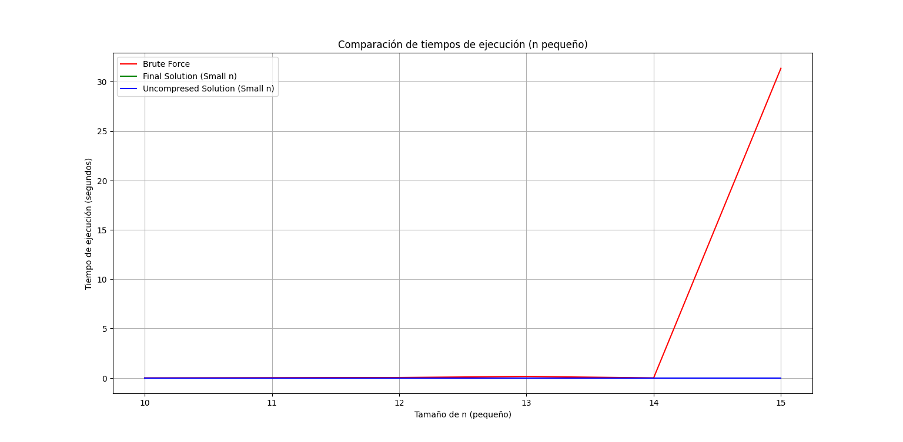
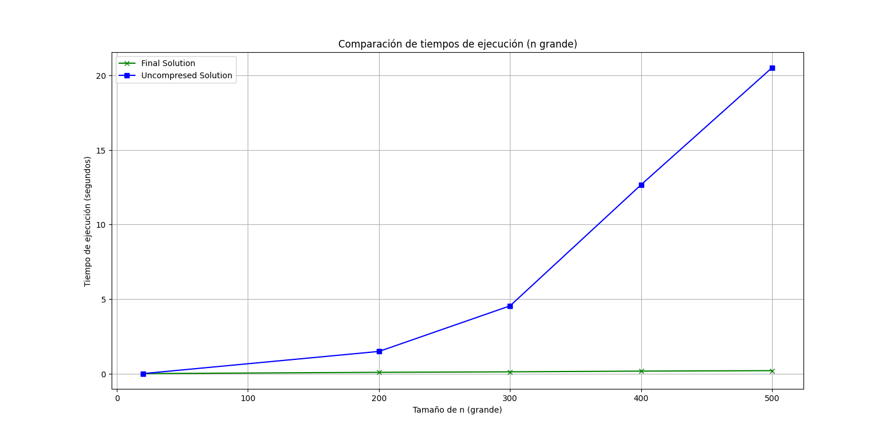

# Grid

Un día iba Maykol por su facultad cuando ve un cuadrado formado por $n \times n$  
cuadraditos de color blanco. A su lado, un mensaje ponía lo siguiente: "Las  
siguientes tuplas de la forma $(x_1, y_1, x_2, y_2)$ son coordenadas para pintar de  
negro algunos rectángulos. (coordenadas de la esquina inferior derecha y superior  
izquierda)" Luego se veían $k$ tuplas de cuatro enteros. Finalmente decía:  
"Luego de tener el cuadrado coloreado de negro en las secciones pertinentes, su  
tarea es invertir el cuadrado a su estado original. En una operación puede seleccionar  
un rectángulo y pintar todas sus casillas de blanco. El costo de pintar  
de blanco un rectángulo de $h \times w$ es el mínimo entre $h$ y $w$. Encuentre el costo  
mínimo para pintar de blanco todo el cuadrado."

En unos 10 minutos Maykol fue capaz de resolver el problema. Desgraciadamente  
esto no es una película y el problema de Maykol no era un problema  
del milenio que lo volviera millonario. Pero, ¿sería usted capaz de resolverlo  
también?

## Formalizando

Dada una matriz de $n \times n$ con $k$ secciones rectangulares pintadas de negro y la posibilidad de pintar de blanco secciones rectangulares de cualquier dimensión $(h \times w)$ con un costo $\min(h, w)$, ¿cuál es el menor costo necesario para que todas las celdas queden pintadas de blanco de nuevo?

## Caso Sencillo del Problema

Primero resolvamos una instancia más sencilla del problema, donde inicialmente no hay $k$ secciones enteras pintadas de negro, sino $t$ celdas individuales pintadas de negro.

### Aprovechando los costos

El costo de las operaciones tal y como fue definido cumple las siguientes propiedades:

1. Es óptimo en cuanto a costo pintar secciones de tamaño $(h, w)$ con $\max(h, w) = n$. Esto se debe a que si $\max(h, w) < n$, el costo sería el mismo que de haber tomado $\max(h, w) = n$, pero nunca estaríamos accediendo a más celdas negras.

2. Sea $S$ una sección, y sean $S_1, S_2, \dots, S_i$ subsecciones contiguas de $S$, obtenidas de dividir a $S$ a lo largo de su dimensión más pequeña. Entonces, el costo de pintar de blanco por separado a cada una de las subsecciones es el mismo que pintar $S$ en una sola operación.

Particularmente, dividir una sección a lo largo de la menor de sus dimensiones en subsecciones cuya menor dimensión tiene longitud 1, y luego pintar cada una de estas subsecciones por separado tiene el mismo costo que haber pintado toda la sección en una sola operación y alcanza el mismo número de casillas negras.

Uniendo ambas propiedades, llegamos a que es óptimo solo pintar secciones de tamaño $(1, n)$ o $(n, 1)$; o sea, solo pintar filas o columnas. Luego, podemos redefinir el problema como:

Dada una matriz de $n \times n$ con $k$ celdas pintadas de negro, ¿cuál es el mínimo número de filas o columnas que debemos pintar de blanco para que toda la matriz quede de color blanco?

### Concretando más

Solo nos interesará considerar pintar de blanco las filas o columnas que contienen al menos una celda negra. Sea $C$ el conjunto de tales filas o columnas. Nos interesa encontrar el menor subconjunto de $C$ tal que incluya todas las celdas negras.

Además, no nos interesa el dato de las dimensiones de la matriz, ya que siempre operamos sobre filas o columnas enteras, ni nos interesan las celdas blancas, puesto que, una vez que una celda es convertida en blanco, no es posible modificar su estado mediante ninguna operación.

Entonces podemos redefinir el problema de una manera más cómoda como:

Dado $t$ puntos en una grilla y el conjunto $C$ de filas y columnas que contienen al menos un punto, ¿cuál es el subconjunto de $C$ de menor tamaño que aún contiene a todos los $t$ puntos dentro de sí?

## Soluciones de Fuerza Bruta

Llamemos **subconjunto bueno** de $C$ a aquellos subconjuntos tales que para todo punto de la grilla, en $C$ existe al menos una fila o columna que lo contiene. Verificar si un subconjunto es bueno tiene complejidad $O(t)$, pues implica comprobar punto a punto.

Una primera solución de fuerza bruta sería tomar como espacio de búsqueda el espacio de los subconjuntos de $C$, y recorrerlo en orden creciente de tamaño de los subconjuntos, hasta encontrar un subconjunto bueno.

El conjunto $C$ tiene a lo más $2t$ elementos, ya que a lo más $t$ filas diferentes y $t$ columnas diferentes pueden contener puntos.

Luego, la complejidad de esta primera solución es $O(2^{2t} \cdot t)$, ya que existen $2^{2t}$ subconjuntos de $C$ y probar cada uno es $O(t)$.

## DFS sobre el espacio de los subconjuntos buenos

Sea $S$ un subconjunto bueno, notemos que añadir filas y columnas a $S$ no hace que deje de ser bueno, por tal motivo es posible añadir filas y columnas a $S$ hasta llegar a $C$, sin pasar en ningún momento por un subconjunto que no sea bueno. Análogamente, para todo subconjunto bueno $S$, es posible alcanzarlo partiendo de $C$ y realizando una secuencia de eliminaciones de elementos de $C$ sin que ninguno de los subconjuntos intermedios por los que transitemos deje de ser bueno. Por tal motivo, podemos presentar esta segunda solución.

Representemos los subconjuntos de $C$ como vértices de un grafo, y establezcamos una arista entre cada par de vértices tales que uno puede ser generado a partir del otro con la eliminación de solo un elemento. Comenzando en el nodo correspondiente al propio conjunto $C$, realicemos un DFS, deteniéndonos cada vez que el nodo a visitar no sea bueno. Luego, el DFS realizará $O(\text{número de subconjuntos buenos})$ operaciones. ¿Cuántos subconjuntos buenos hay?

Tomemos el caso en que todos los puntos se encuentran ubicados a lo largo de una sola fila. Entonces habrá $t$ columnas diferentes. Luego habrá $2^t$ subconjuntos de $C$ que contienen a la fila en cuestión y, por tanto, son buenos; además será bueno el conjunto que contiene a todas las columnas pero no a la fila. Luego, en este caso habría $2^t + 1$ conjuntos buenos. Como podemos apreciar, esta solución es también exponencial. (Falta probar rigurosamente que es $O(2^t \cdot t)$).

## Representando como grafo

Cada punto se encuentra solo en una fila y una columna. Cada fila y cada columna tienen en común a lo más un punto. Es decir, los puntos establecen una relación entre las filas y las columnas. Formalmente:

Una **relación binaria** entre dos conjuntos $A$ y $B$ es un subconjunto de su producto cartesiano. Los puntos son un subconjunto del producto cartesiano entre las filas y las columnas.

Luego, probemos crear un grafo $G$, donde a cada fila y a cada columna corresponde un vértice, y solo existen aristas entre aquellos nodos representantes de filas y columnas que tienen un punto en su intersección.

## Entra el Minimum Vertex Cover

Notemos que con esta representación nuestro problema se reduce al **Minimum Vertex Cover**. El problema del minimum vertex cover se define como: dado un grafo, encontrar el menor subconjunto de los vértices (filas o columnas en nuestro problema), necesarios para que todas las aristas del grafo (puntos en nuestro problema) tengan al menos uno de sus dos extremos incluido.

El problema del **Minimum Vertex Cover** es **NP-completo**; pero en grafos bipartitos tiene una solución polinómica, derivada del **Teorema de König**, que enuncia que en grafos bipartitos el minimum vertex cover tiene el mismo tamaño que el **maximum matching**. Luego, hemos reducido el problema a calcular el **maximum matching** del grafo generado.

El algoritmo de **Hopcroft-Karp** computa el maximum matching de un grafo bipartito en $O(|E|\sqrt{|V|})$. Notemos que para el grafo que hemos creado se cumple que $|V| = t$ y $|E| = 2t$, por lo que la complejidad de nuestro algoritmo sería $O(t\sqrt{t})$ si usamos Hopcroft-Karp y $O(t^2)$ si usamos Dinic. No obstante, notemos que a su vez $t$ es $O(n^2)$, puesto que una sección pintada de negro puede contener hasta $n^2$ celdas en su interior. Luego, la complejidad de nuestro algoritmo sería $O(n^4)$.

Si en lugar de Hopcroft-Karp, usáramos el más general y sencillo de implementar algoritmo de **Edmonds-Karp**, la complejidad sería mayor, ya que la complejidad de Edmonds-Karp es $O(|V||E|^2)$, lo que aplicado a nuestro problema lo llevaría al orden de $O(n^6)$. Esta complejidad es muy limitante.

## Compresión

No obstante, busquemos aprovechar la forma en que fueron dispuestas en secciones las celdas negras e intentemos realizar una compresión. 

Si bien las $k$ secciones pueden abarcar $n$ filas, solo existirán $2k$ filas frontera (que son la primera o la última de una sección). Luego, podemos agrupar a todas las filas en $2k$ rangos. El $i$-ésimo rango abarcará a todas las filas entre la $i$-ésima fila frontera (incluida) y la fila frontera $i+1$ (excluida). Podemos realizar la operación análoga con las columnas.

Dos celdas que compartan rango en cuanto a fila y en cuanto a columna están pintadas de la misma manera. Esto se debe a que, si están pintadas de color diferente, una de ellas estará dentro de una de las secciones pintadas iniciales, mientras que la otra está fuera de cualquier sección pintada. Pero si una está adentro y la otra afuera, entre ellas debe haber una fila frontera, y si hubiera una fila frontera, ya sea horizontal o vertical entre ellas, entonces no compartirían el rango de fila o de columna, respectivamente.

Sea una **sección compuesta** únicamente por celdas que compartan rango de fila y columna. Realizar la operación de pintar todo un rango de filas o de pintar todo un rango de columnas nunca provocará que en la sección aparezcan celdas de colores diferentes (nuevamente, porque esto implicaría la presencia de una frontera dentro de la sección).

Luego, cada sección compuesta por celdas que comparten rango de fila y columna es monocromática respecto a las operaciones sobre rangos enteros de filas o columnas, de manera análoga a cómo las celdas individuales son monocromáticas respecto a las operaciones sobre filas o columnas.

Así, podemos crear a partir del problema original una nueva grilla donde cada fila o columna corresponde a un rango de filas o columnas, y cada celda corresponde a una sección de celdas del problema original que comparten rango de filas y de columnas. Esta nueva grilla, en lugar de tener dimensiones $n \times n$, tiene dimensiones $k \times k$, con lo cual hemos dejado a la variable $n$ correr libre, sin restricciones.

## Adaptando el flujo

No obstante, aún falta un detalle para poder resolver el problema. En esta nueva grilla, el costo de eliminar una fila o una columna es la longitud del rango al que representa. Luego, el problema no será precisamente encontrar el subconjunto de menor tamaño, sino el de **menor costo** de las filas y las columnas, tal que contengan dentro de sí a todas las celdas negras de la grilla.

Si realizamos la misma representación en forma de grafo, asignándole un vértice a cada fila o columna, y una arista entre cada fila y cada columna; y además asignamos a cada vértice un costo (el de eliminar la fila o columna correspondiente), entonces el problema se reduce a encontrar el **Minimum Cost Vertex Cover**, que no es lo mismo que el **Minimum Vertex Cover**.

## Minimum Cost Vertex Cover

El problema del **Minimum Cost Vertex Cover** es una generalización del problema del **Minimum Vertex Cover** y, al igual que este último, es **NP-completo**, pero existe una solución en tiempo polinomial para él.

La solución en tiempo polinomial parte de la generalización del **teorema de König** a grafos ponderados, que es el **Teorema de Evergény** (Schrijver, 2003, p. 318). El Teorema de Evergény, en esencia, afirma que el costo del Minimum Cost Vertex Cover es igual al peso del **Maximum Weight Matching** de un grafo equivalente.

Luego, solo nos queda transformar el grafo que tenemos, donde los vértices están ponderados, en un grafo donde las aristas tengan asignadas una capacidad y sea posible computar el flujo máximo. Para ello, sencillamente conectaremos un nodo source a todos los vértices correspondientes a filas, asignando por capacidad a su arista el ancho de la fila en cuestión. De manera análoga, conectaremos todos los nodos columna a un nodo sink. Para las demás aristas, colocaremos capacidad infinita.

Finalmente, podemos calcular el flujo máximo. Para ello, usaremos el **algoritmo de Edmonds-Karp**. La complejidad final de nuestra solución será entonces $O(k^5)$, donde $k$ es el número de secciones iniciales.

## Casos de Pruebas y Resultados

Se realizaron pruebas de rendimiento y exactitud para comparar las implementaciones de los algoritmos de **fuerza bruta**, **solución final optimizada**, y **solución descomprimida** en varios tamaños de entrada. A continuación, se presentan los resultados de los casos de prueba:

## Descripción de los Casos de Prueba

1. **Tamaño pequeño de n**:
   - Se realizaron pruebas con tamaños de n entre 10 y 15, utilizando el algoritmo de fuerza bruta para comparar el rendimiento con las otras dos soluciones.
   - El valor de m se estableció como el 10% de n.
   
2. **Tamaño grande de n**:
   - Se probaron valores grandes de n (entre 20 y 500), comparando las dos implementaciones más eficientes.
   - El valor de m se mantuvo constante en 50 para simular la complejidad adicional con un número fijo de secciones pintadas.

### Gráficos de Resultados

### Comparación de Tiempos de Ejecución (n pequeño)

El siguiente gráfico muestra el tiempo de ejecución de las tres implementaciones (Fuerza Bruta, Solución Final, y Solución Descomprimida) en tamaños de n pequeños:

### Comparación de Tiempos de Ejecución (n grande)

Este gráfico muestra los tiempos de ejecución para las soluciones más eficientes (Solución Final y Solución Descomprimida) en tamaños grandes de n:

### Análisis de Resultados

- **Tiempos de ejecución en n pequeño**: Como se esperaba, el algoritmo de fuerza bruta es significativamente más lento que las otras dos soluciones en cuanto los tamaños de n aumentan.
- **Tiempos de ejecución en n grande**: A partir de n valores más grandes, la **solución final** mostró un mejor rendimiento en comparación con la solución descomprimida, aunque en el anterior ambas mantuvieron una diferencia notable con la fuerza bruta.

## Referencia

Schrijver, A. (2003). *Combinatorial optimization: Polyhedra and efficiency* (Vol. 24). Springer-Verlag.

