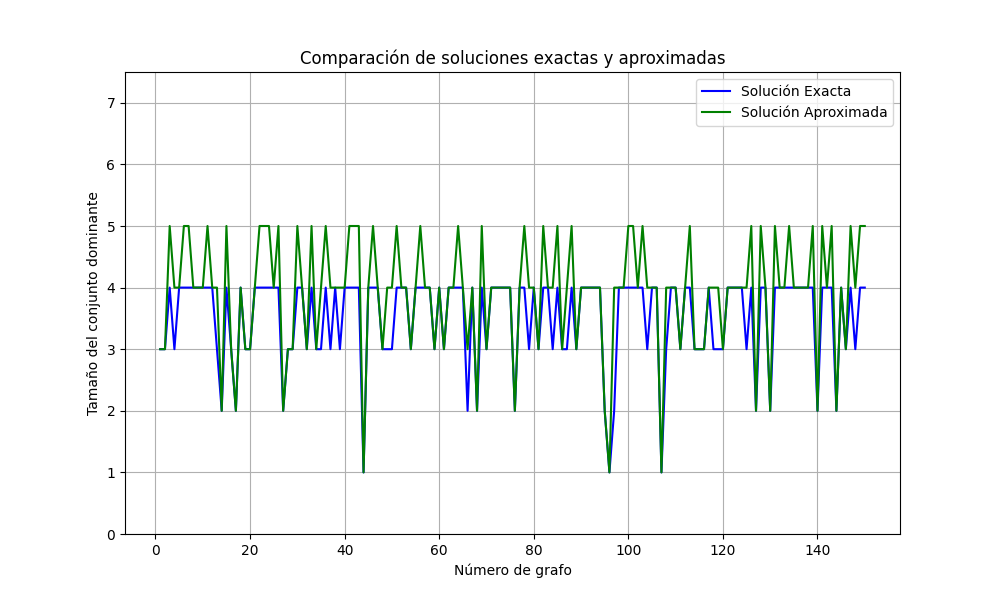
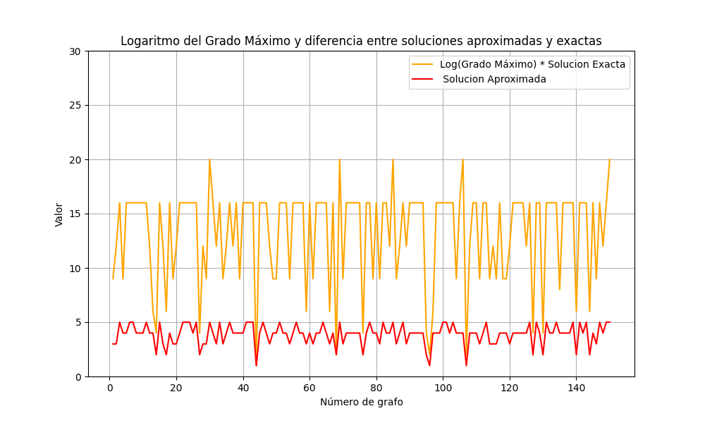

# El secreto de la Isla

En el corazón del vasto océano azul, existe una isla tropical conocida como La Isla de Coba, un lugar de exuberante vegetación y antigua sabiduría. La tribu que habita en esta isla ha vivido en armonía con la naturaleza durante siglos, guiados por un consejo de ancianos que custodian el equilibrio entre los habitantes de la isla y sus recursos.

Sin embargo, una nueva generación de líderes debe ser elegida, y para ello, los ancianos han planteado un desafío ancestral. Los aspirantes al consejo deben descubrir un grupo selecto de **guardianes**, quienes, colocados en puntos estratégicos de la isla, podrían vigilar a todos los aldeanos sin dejar a ninguno sin supervisión directa o indirecta.

La isla tiene una serie de aldeas unidas entre ellas por caminos. El reto es encontrar un grupo de guardianes tan pequeño como sea posible, de modo que cada aldea esté bajo la protección directa de un guardián, o al menos, esté conectada a una aldea donde se haya asignado un guardián.

Los jóvenes líderes deben resolver este desafío para mostrar su valía. Con cada nueva selección de guardianes, la estabilidad de la isla se estremece. El futuro de La Isla de Coba depende de que uno de los jóvenes (como tú) encuentre esta distribución óptima de guardianes y se convierta en el próximo jefe absoluto.

# Solución del Problema

## Generalización del problema

Eliminando las particularidades del problema (aldeas, guardianes, etc.) tenemos que:  
Dado un grafo $G = (V,E)$, debemos encontrar el subconjunto de vértices $D$ más pequeño, tal que cada vértice de $V$ pertenece a $D$ o es adyacente a al menos un vértice de $D$.

Al problema anterior se le denomina problema del conjunto dominante (dominating set problem), un problema $NP-completo$.

## Dominating Set Problem

Formalmente, el conjunto dominante se define como:  
Dado un grafo no dirigido $G = (V,E)$, un subconjunto de vértices $D \subseteq V$ se llama conjunto dominante si para cada vértice $u \in V \setminus D$ hay un vértice $v \in D$ tal que $(u,v) \in E$.

El número de dominancia de $G$ se define como $Y(G) := \min \{|S| : S \text{ es un conjunto dominante de } G\}$.

El *dominating set* en un grafo con vértices aislados, los incluye por fuerza. Luego, el problema de computar el *dominating set* de un grafo con vértices aislados puede ser resuelto computando el *dominating set* del mismo grafo sin los nodos aislados y luego incorporando estos al resultado.  
Por tanto, pasemos a demostrar que computar el *dominating set* de un grafo sin vértices aislados es NP-Hard.  
Para ello, parece natural realizar una reducción desde *Vertex Cover* hasta *Dominating Set*, puesto que cada cubrimiento de un grafo sin nodos aislados es un *dominating set* de este; aunque no necesariamente el *Minimum Dominating Set*.

## Demostrando que es NP-Completo

Mostremos que el problema de decisión de decidir si existe un *dominating set* de tamaño $k$ en un grafo es un problema NP-Completo.

El problema pertenece a NP, ya que una solución candidata puede ser verificada en tiempo polinomial, con tan solo computar el conjunto de vértices dominados y verificar que su tamaño sea igual al número total de vértices del grafo.

Ahora encontremos una reducción en tiempo polinomial desde el problema del *Vertex Cover* al problema del *Dominating Set*. Esto nos permitirá afirmar que *Dominating Set* es NP-Hard, con lo cual completaríamos la demostración de que es NP-Completo.

Para un grafo $G(V, E)$, definamos el grafo $G'$, como el resultante de mantener todos los vértices y aristas de $G$ y añadir un vértice $w$ por cada arista $\langle u, v \rangle$. Tal vértice $w$ tendrá solamente aristas a los vértices $u$ y $v$.  
Sea $D$ un *dominating set* de tamaño $k$ de $G'$.  
Si $D \subset V$, entonces, $D$ es un *vertex cover* de $G$, puesto que para cualquier nodo de $V$ que no esté en $D$, este se encontrará a distancia 1 de un nodo en $D$. O sea, para toda arista al menos uno de sus extremos está en $D$.  
Si $D \nsubseteq V$, es posible obtener un *dominating set* $D'$ de tamaño $k$ en $G'$ que sí cumpla $D \subset V$, tan solo con sustituir todo vértice $w$ no perteneciente a $V$, con uno de los dos vértices a los que está conectado. Sea $u$ tal vértice. $u$ estará conectado a todos los nodos a los que lo estaba $w$, ya que $w$ solo estaba conectado a $u$ y a un nodo $v$ tal que existe una arista entre $u$ y $v$, por lo cual $u$ también está conectado a él. Este conjunto $D'$, sí será *vertex cover* de $G$.

Por otro lado, sea $C$ un *vertex cover* de tamaño $k$ del grafo $G$. Entonces, todo vértice de $G$ se encuentra a una distancia de a lo más 1 de un vértice del *vertex cover*, ya que para cada arista al menos uno de sus extremos está incluido en el *vertex cover* y en este grafo no hay nodos aislados.  
Además, como para cada vértice $w$ que no está en $G$ pero sí en $G'$, se cumple que tiene una arista hacia los dos nodos de una arista, y al menos uno de los nodos de la arista está en $C$, entonces $w$ se encuentra a una distancia 1 de al menos un nodo en $C$.

El algoritmo de conversión es meramente añadir un vértice y dos aristas por cada arista original, lo cual es polinómico.  
Luego, como decidir si existe un *Vertex Cover* de tamaño $k$ en un grafo $G$ es equivalente a aplicar la conversión planteada, obteniendo el grafo $G'$, y decidir si existe un *Dominating Set* de tamaño $k$ en $G'$; entonces, el problema de *Dominating Set* es NP-Completo.

## Encontrar la solución exacta

Para encontrar la solución exacta del problema del **Conjunto Dominante**, es necesario evaluar todas las combinaciones posibles de subconjuntos de vértices, lo cual puede tener una complejidad exponencial de $O(2^n)$, siendo $ n $ el número de vértices en el grafo. Sin embargo, existen algoritmos que mejoran esta complejidad.

### Algoritmos que reducen la complejidad a $1.5^n$

Se han desarrollado algoritmos que mejoran el tiempo de resolución exacta utilizando técnicas avanzadas de **ramificación y poda**, logrando reducir la complejidad a $O(1.5^n)$. Estos algoritmos son ideales para grafos de tamaño moderado, permitiendo resolver el problema exacto en menos tiempo que los algoritmos ingenuos de fuerza bruta.

## Algoritmos de Aproximación

Dado que encontrar la solución exacta es computacionalmente costoso para grafos grandes, los **algoritmos de aproximación** son una alternativa eficaz. Uno de los más comunes es el **algoritmo greedy**, que selecciona nodos de manera ávida, cubriendo en cada paso la mayor cantidad posible de nodos no cubiertos.

El **algoritmo greedy** no garantiza la solución óptima, pero ofrece una solución cercana en un tiempo razonable. La aproximación que ofrece está relacionada con el logaritmo del **grado máximo** ($\Delta$) del grafo .

Para obtener más detalles sobre la demostración de que el algoritmo greedy tiene una aproximación de $O(\ln(\Delta))$, pueden consultar el siguiente enlace:

[Demostración de la Aproximación del Algoritmo Greedy](greedy_complejidad.md)

## Resultados de los Tests

A continuación se muestran los gráficos obtenidos tras la ejecución de los tests que comparan las soluciones exactas y aproximadas, así como el análisis del logaritmo del grado máximo.

### Comparación de Soluciones Exactas y Aproximadas

### Logaritmo del Grado Máximo y Solucion Aproximadas

Los gráficos muestran claramente las diferencias entre las soluciones obtenidas de manera exacta y las soluciones aproximadas mediante el algoritmo greedy. El análisis del logaritmo del grado máximo también proporciona información sobre la calidad de las aproximaciones obtenidas.
